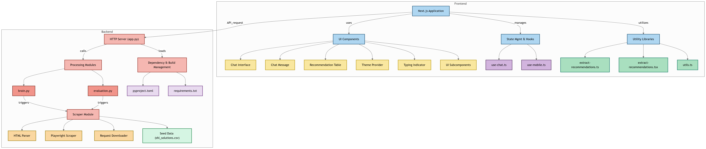

# SHL RAG Bot: Technical Approach

## Architecture Overview
The application follows a modern, decoupled architecture with a Next.js frontend and a FastAPI Python backend. The system diagram shows a clear separation between frontend and backend components, with API communication between them.

### Frontend (Next.js)
- **Framework**: Next.js 15.2.4 with React 19
- **UI Components**: Combination of custom components and Radix UI primitives
- **State Management**: React's built-in state management with hooks
- **Styling**: Tailwind CSS 4.1.3 for utility-first styling
- **Key Components**:
  - Chat Interface & Message components
  - Recommendation Table
  - Theme Provider
  - Responsive design with desktop/mobile support

### Backend (Python FastAPI)
- **Framework**: FastAPI for high-performance API endpoints
- **RAG Implementation**: LlamaIndex as the core RAG framework
- **LLM Integration**: Groq integration via `llama-index-llms-groq`
- **Vector Database**: AstraDB for efficient vector storage via `llama-index-vector-stores-astra-db`
- **Embeddings**: NVIDIA embeddings via `llama-index-embeddings-nvidia`
- **Data Processing**:
  - BeautifulSoup4 for web scraping
  - Playwright for browser automation
  - Pandas for data manipulation
  - OpenPyXL for Excel file processing

### Data Flow
1. User sends a query through the chat interface
2. Frontend sends an API request to the backend
3. Backend processing modules:
   - Query the vector database for relevant documents
   - Combine retrieved context with the user query
   - Generate a response using the LLM
   - Send structured response back to frontend
4. Frontend renders the response with appropriate UI components

### Development Workflow
- **Development**: Next.js dev server with Turbopack for fast refreshes
- **Build Process**: Standardized build scripts for both frontend and backend
- **Code Quality**: ESLint for JavaScript/TypeScript linting
- **Dependency Management**: npm for frontend, Python project structure for backend

### Evaluation & Testing
- DeepEval for evaluating RAG system performance
- Continuous testing to ensure response quality and accuracy

### Key Components

1. **Backend API (`backend/app.py`)**  
    
    - Built with **FastAPI**.  
        
    - Provides an OpenAI-compatible endpoint (`/v1/chat/completions`) for chat interactions and specific endpoints (`/api/recommend`, `/recommend`) for solution recommendations.  
        
    - Handles user queries, retrieves relevant context from a vector database using the `brain` module, and interacts with a Large Language Model (LLM) via the **Groq API** (Llama 3 models) to generate responses or recommendations.  
        
    - Includes **rate limiting** based on tokens per minute.  
        
    - Formats recommendations clearly, including mapping test type codes to full names.  
        
    - Defines Pydantic models for structured request/response handling.  
        
2. **Core RAG Logic (`backend/brain.py`)**
    
    - Manages connections to **Astra DB** (vector store) and **NVIDIA embedding models** (`nvidia/llama-3_2-nv-embedqa-1b-v2`).  
        
    - Uses **LlamaIndex** for the RAG pipeline implementation.  
        
    - Parses SHL solution data from CSV files.  
        
    - Implements text chunking and tokenization (using `tiktoken`) optimized for RAG and model limits (e.g., 512 tokens for NVIDIA embeddings).  
        
    - Stores processed and embedded data in Astra DB.  
        
    - Provides search functionality (`search_astra`) to query the vector store.  
        
    - Includes optional (currently disabled) **NVIDIA reranking** integration.  
        
    - Offers command-line interface for indexing and searching.  
        
3. **Web Scraper (`backend/scraper/`)**
    
    - Contains scripts to download and parse SHL's online product catalog.
    - `playwright_scraper.py`: Uses **Playwright** for dynamic web scraping, handling potential bot detection.  
        
    - `catalog_html_parser.py` & `product_html_parser.py`: Use **BeautifulSoup** to parse HTML content and extract product details.  
        
    - Generates intermediate CSV files (`shl_solutions.csv`, `shl_solutions_with_details.csv`) containing the scraped data.  
        
4. **Evaluation (`backend/evaluation.py`)**
    
    - Uses the **`deepeval`** library for evaluating the RAG system.  
        
    - Defines a golden dataset (`GOLDEN_SET`) for testing.  
        
    - Implements custom metrics: **Mean Recall@K** and **Mean Average Precision@K**.  
        
    - Leverages **Google Gemini Pro** (via `instructor`) to generate qualitative explanations for evaluation scores.  
        
5. **Configuration & Dependencies (`.env.example`, `pyproject.toml`, `uv.lock`)**
    
    - Requires API keys for Astra DB, NVIDIA, Groq, and optionally Google.  
        
    - Key Python dependencies include: `fastapi`, `llama-index-*`, `astrapy`, `httpx`, `pydantic`, `tiktoken`, `groq`, `nvidia-*`, `deepeval`, `playwright`, `beautifulsoup4`, `pandas`.  
        
    - The project is configured for Python 3.12.

## Implementation Highlights
- Modular architecture allowing for easy component replacement
- Separation of concerns between UI, state management, and data retrieval
- Optimized for both development experience and production performance
- Responsive design supporting various device types
- Type safety through TypeScript on the frontend and Pydantic on the backend

